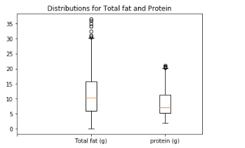
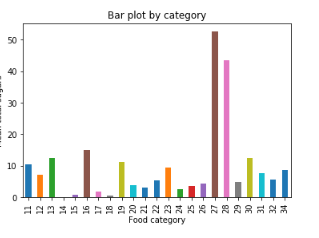
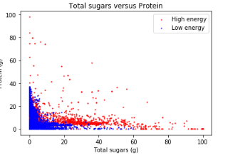
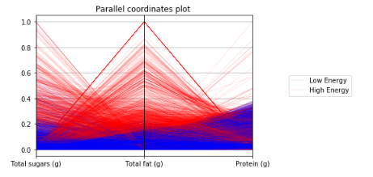
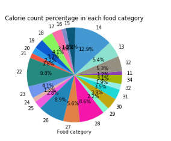
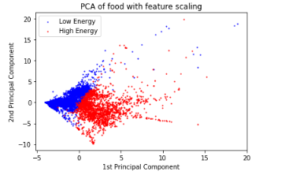
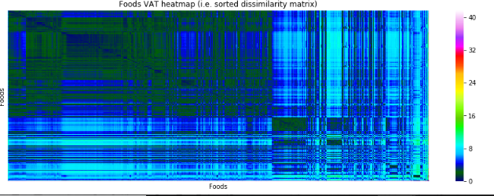
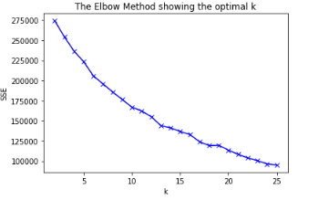
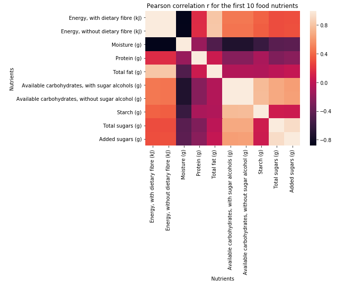
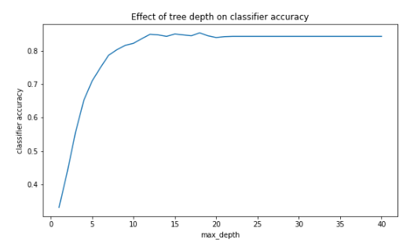

# Food-Nutrient-Data-Wrangling
## Introduction
In this project, I will use Python as the scripting language to manipulate data in a open source database from [Food Standards Australia and New Zealand](http://www.foodstandards.gov.au/science/monitoringnutrients/ausnut/ausnutdatales/Pages/foodnutrient.aspx).

The main techniques in this project includes: 
+ Cleanning 
+ Visualisation 
+ Clustering 
+ Correlations 
+ Predicitons

## Implementation: 
For this project purpose, these library will be need to imported: 
+ import pandas as pd
+ import numpy as np
+ import matplotlib.pyplot as plt
+ from sklearn.preprocessing import StandardScaler
+ from sklearn.decomposition import PCA
+ from scipy.spatial.distance import pdist, squareform
+ import seaborn as sns
+ from sklearn.model_selection import train_test_split
+ from sklearn.neighbors import KNeighborsClassifier
+ from sklearn.metrics import accuracy_score
+ from sklearn.tree import DecisionTreeClassifier
+ from sklearn.cluster import KMeans
+ from scipy.spatial.distance import cdist

## Project: 
See the assignment description attached for more information.

Stage 1: Cleanning and visualisation techniques
+ Count the total number of foods and attributes then calculate the median value of a attribute.
+ Add a new attribute to the dataset
+ Visualisation using boxplot
 

+ Visualisation using barplot

+ Visualisation using scatterplot

+ Visualisation using parallel co-ordinates 

+ Visualisation using pie chart

+ Merge and export data to JSON format

Stage 2: clustering, correlations and predictions techniques
+ Standardisation database for effectively techniques using
+  Principle components analysic (PCA)

+ Clustering visualisation

+K-means and sum of squared errors

+ Correlation and Mutual Information

+Prediction models: decision trees

+ Prediction models: K-NN
+ Feature generation
## Note:
This project is a university assignment from Element of Data Processing subject in The University of Melbourne, Department of Computing  and Software System, Semester 1 2019.
